# Árvores

## Percurso

### Pre Ordem
Primeiro raiz, subárvore esquerda e por fim, subárvore a direita.
#### Exemplos:

[1]

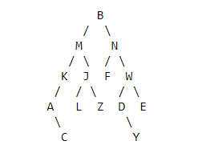

Resolvido:  
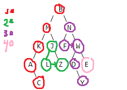

Pré-ordem: B M K A C J L Z N F W D Y E

[2]

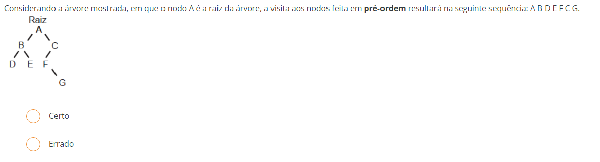

Resolvido:  
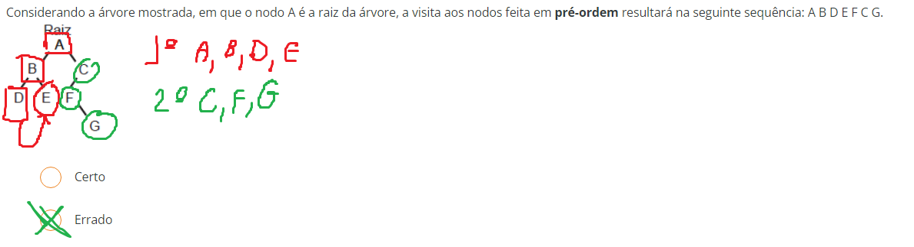

[3] 
Resolvido:  
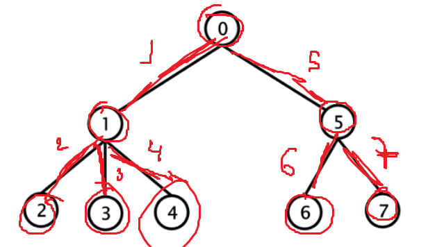

Desafio:
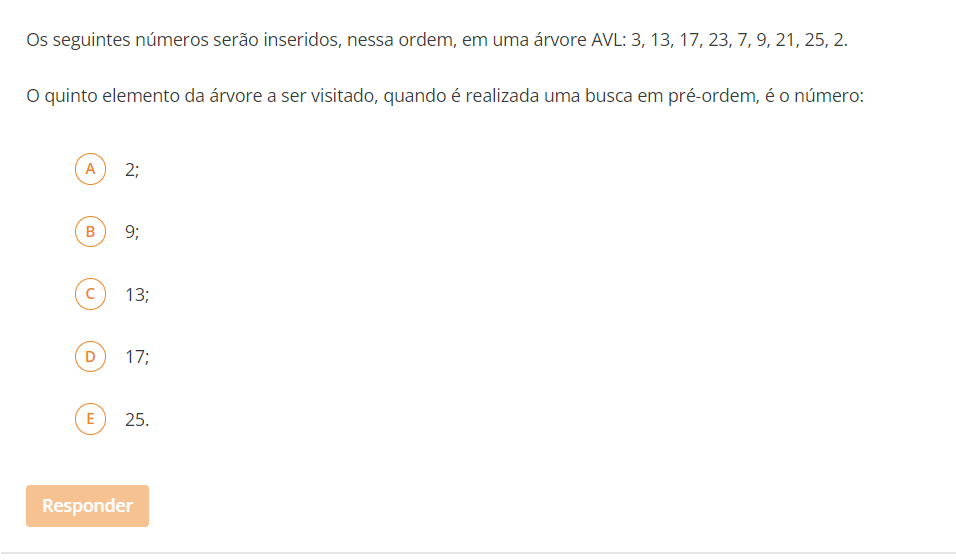
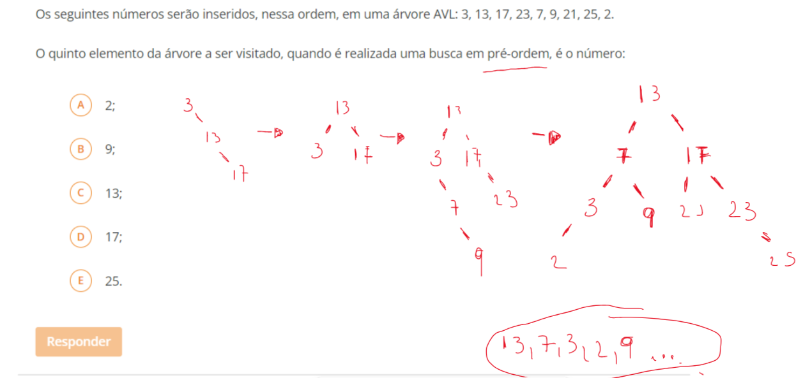

### Em ordem
Subárvore esquerda, depois raiz, depois subárvore a direita

[1]
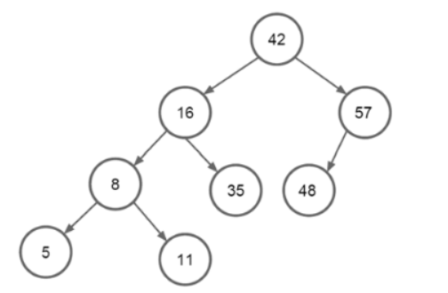
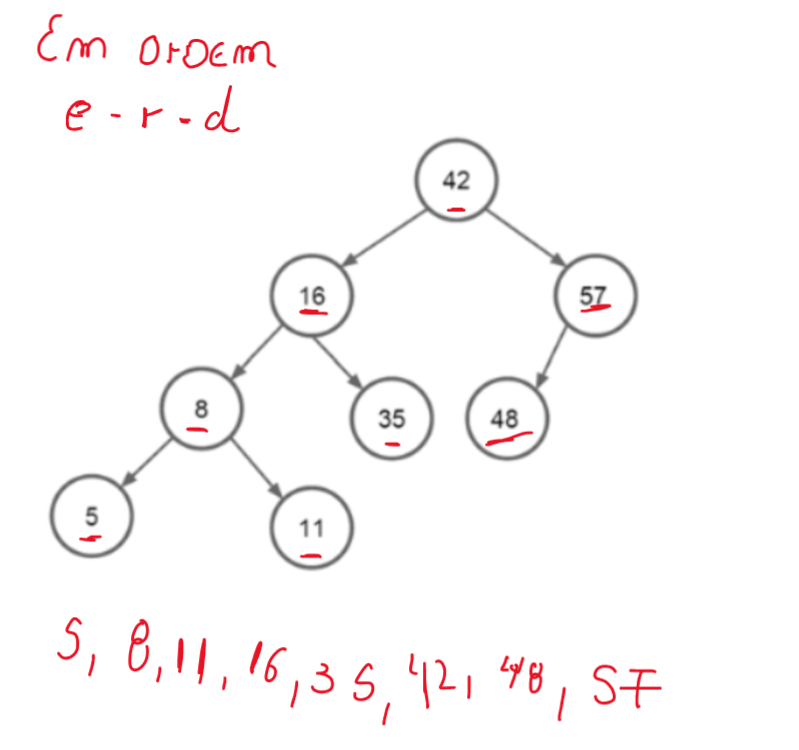

[2]

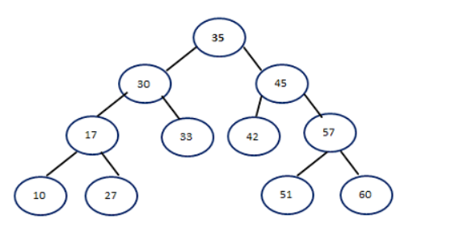
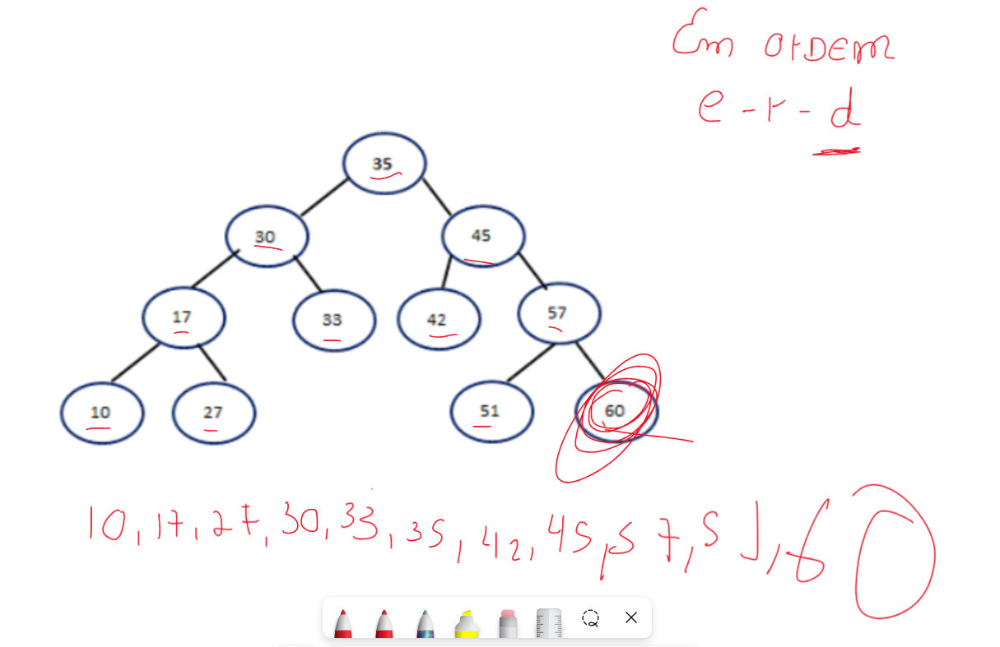

[3]
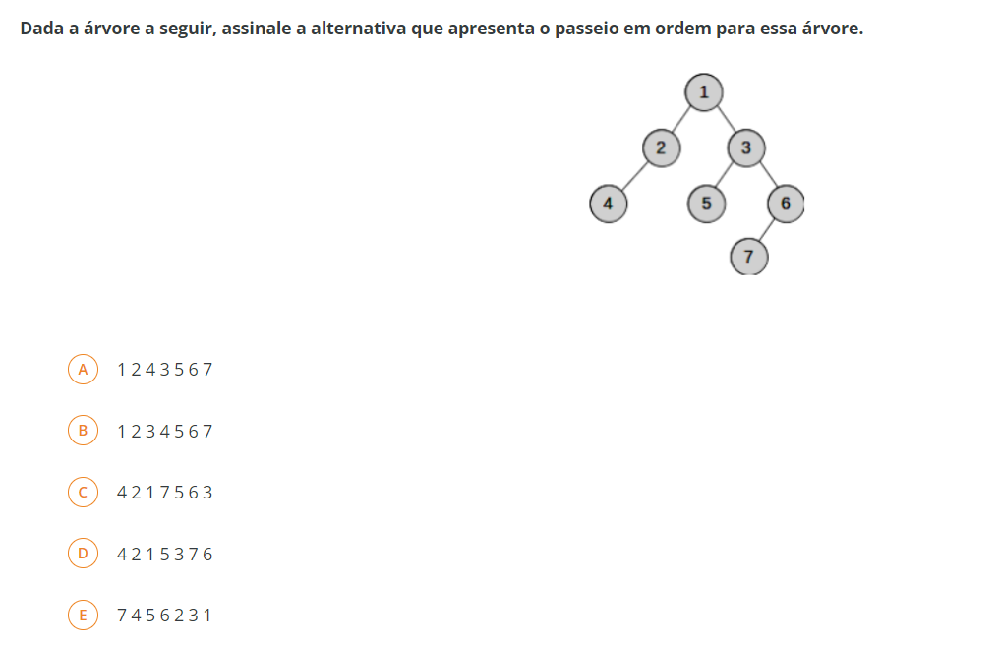
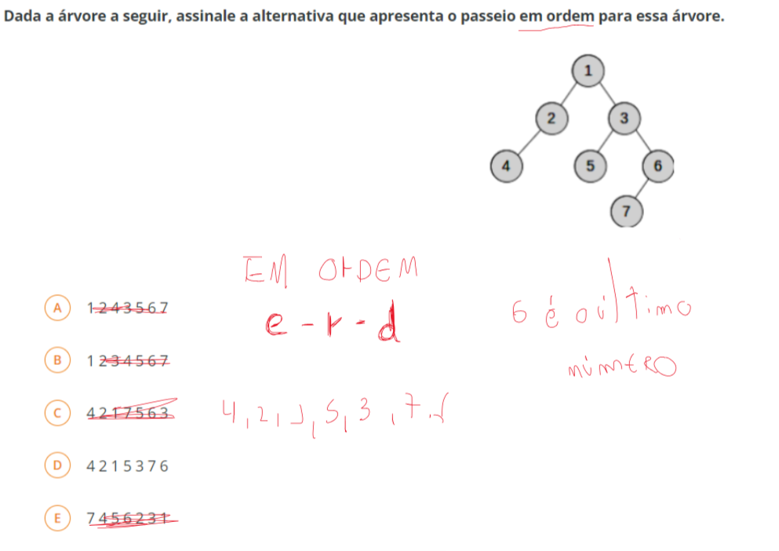

### Pós ordem
Subárvore a esquerda, depois a direito e por último a raiz

[1]
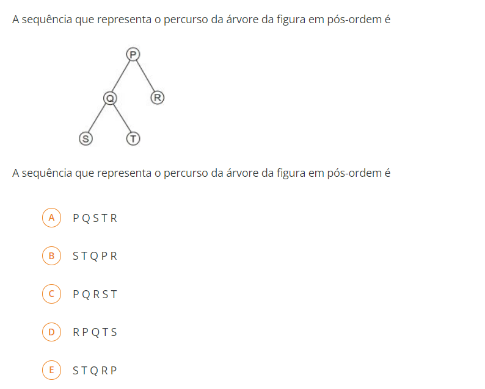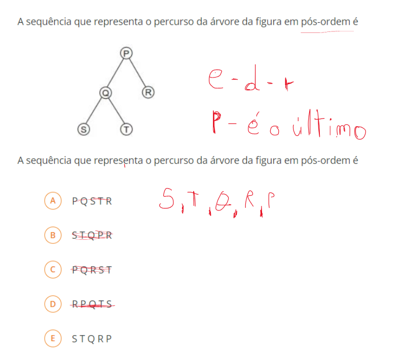

[2]
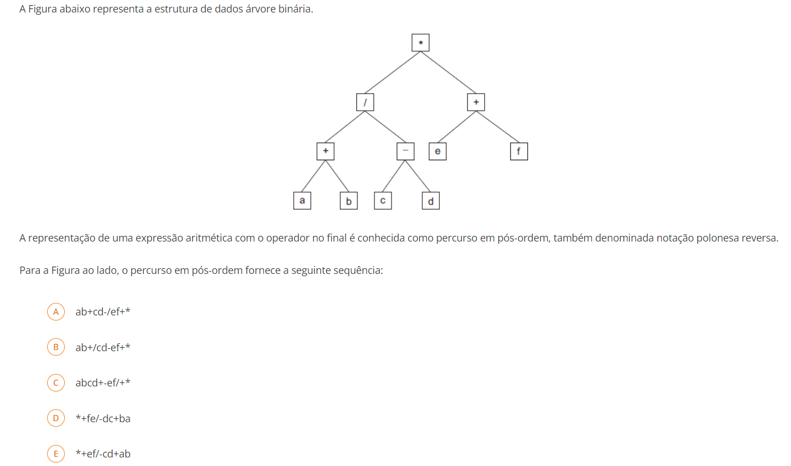
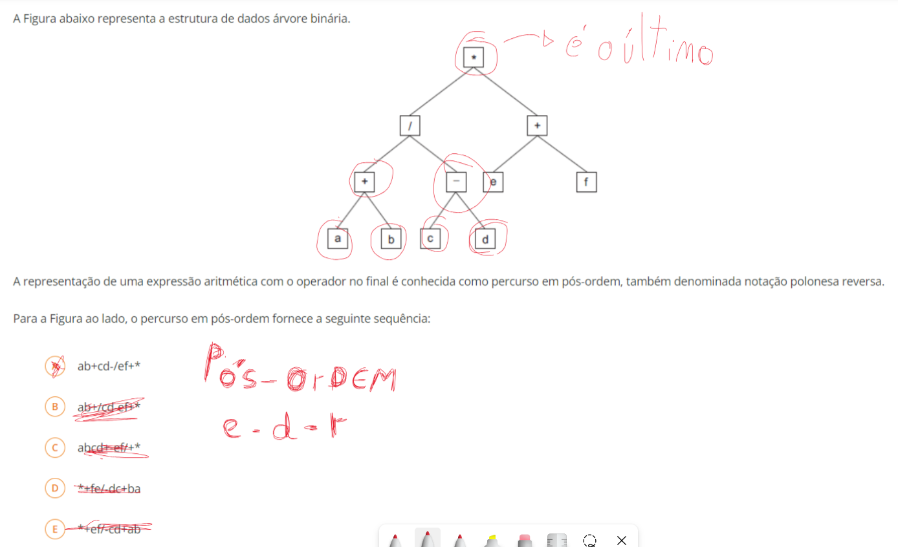

[3]
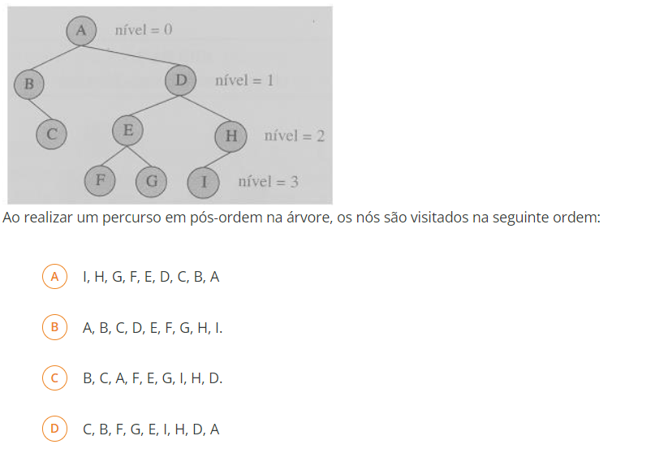

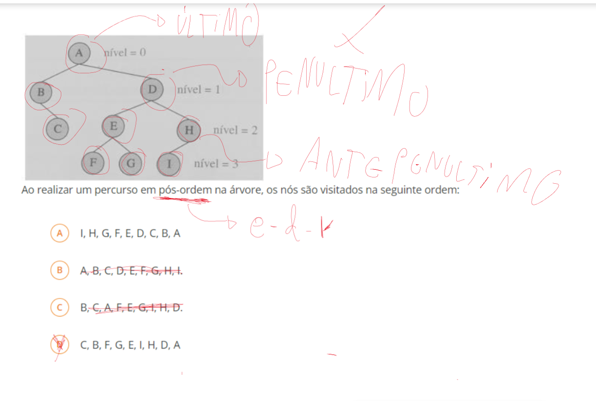